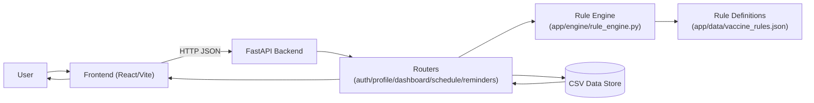

# Project Architecture

## High-Level Overview
This project is a full-stack vaccine eligibility platform:
- **Frontend (React + Vite)**: collects profile data and displays statuses, schedule, and reminders.
- **Backend (FastAPI + pandas store)**: authenticates users, stores records, runs the vaccine rule engine, and returns classified outcomes.
- **Data Store (CSV files)**: persists users, profiles, vaccines, records, and reminders in `backend/data_store`.

## System Diagram

## Request/Data Flow
1. User signs up/logs in and submits profile + health flags.
2. Backend stores profile and vaccine history records in CSV files via the pandas store.
3. Dashboard/Schedule endpoints call the rule engine.
4. Rule engine loads JSON rules, evaluates age/risk/cohort/timing logic, and classifies each vaccine.
5. Backend returns normalized results (`OVERDUE`, `DUE_SOON`, `UP_TO_DATE`, `NOT_ELIGIBLE`) to the frontend.
6. Frontend renders timeline/table views and reminder actions using local-date parsing to avoid timezone shift bugs.

## Key Backend Files
- `backend/app/main.py`: FastAPI app entrypoint and router registration.
- `backend/app/pandas_store.py`: CSV-based persistence and adapters for engine input objects.
- `backend/app/database.py`: compatibility shim (legacy).
- `backend/app/models.py`: ORM entities (users, patient profile, vaccines, records, reminders).
- `backend/app/schemas.py`: Pydantic request/response validation models.
- `backend/app/dependencies.py`: auth/DI helpers used by routers.
- `backend/app/data/vaccine_rules.json`: configurable vaccine policy/rule data.
- `backend/app/engine/rule_engine.py`: core inference/classification logic.
- `backend/app/routers/auth.py`: signup/login endpoints.
- `backend/app/routers/profile.py`: create/read/update patient profile endpoints.
- `backend/app/routers/dashboard.py`: vaccine status summary endpoint.
- `backend/app/routers/schedule.py`: upcoming schedule endpoint.
- `backend/app/routers/reminders.py`: reminder simulation/history endpoints.
- `backend/seed_vaccines.py`: bootstrap vaccine catalog data into DB.

## Key Frontend Files
- `frontend/src/main.jsx`: React bootstrap.
- `frontend/src/App.jsx`: route wiring for app pages.
- `frontend/src/api/index.js`: centralized API client calls to backend.
- `frontend/src/components/Navbar.jsx`: top navigation/header.
- `frontend/src/components/TopStrip.jsx`: QDoc-style top contact strip.
- `frontend/src/components/QdocLegacySection.jsx`: branded content/footer section.
- `frontend/src/pages/Landing.jsx`: entry page.
- `frontend/src/pages/Profile.jsx`: patient profile input/edit page.
- `frontend/src/pages/Dashboard.jsx`: vaccine eligibility/status table page.
- `frontend/src/pages/Schedule.jsx`: due/upcoming timeline page.
- `frontend/src/index.css`: global theme tokens/base styles.

## Test Architecture
- `backend/tests/engine/test_rule_engine.py`: rule engine behavior and edge/boundary tests.
- `backend/tests/schemas/test_profile_schemas.py`: input validation/schema tests.
- `backend/tests/conftest.py`: shared test setup/import plumbing.
- Current status: `74 passed` (`backend`, `pytest -q`).

## Rule Engine Highlights (Current)
- Dynamic dose requirements:
  - `pneu_c_15`: 3-dose infant path vs 1-dose catch-up path.
  - `hpv`: 2 doses if started before age 15, otherwise 3.
  - `hepatitis_b`: 2 baseline doses, 3 for high-risk profiles.
  - `mmr`: birth-year cohort logic (including immune cohort handling).
- Eligibility sequencing:
  - Age and contraindication checks first.
  - Age 65+ path is handled before risk gates for vaccines with `eligible_at_65_plus`.
- Key policy nuances:
  - Rotavirus start-window guard for unstarted series.
  - Men-C-ACYW long interval scheduling (grade-6 style spacing).

## Design Intent
- Keep vaccine policy mostly data-driven via JSON.
- Keep inference deterministic and explainable for clinical and judging transparency.
- Keep API outputs normalized so frontend rendering is simple and consistent.
